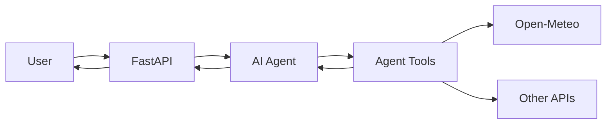

# 🌍 Smart Travel Agent


A structured AI-powered travel assistant built with **FastAPI**, the **OpenAI Agents SDK**, and **Open-Meteo**.

The project is being developed step by step as a personal learning project focused on clean architecture, AI function tools, external API integrations, testing, and professional Git workflows.

## 🎯 Final Goal

The final application will allow users to ask natural-language travel questions such as:

```text
What will the weather be in Tirana for the next five days?
```

```text
Find Berlin and show me its coordinates and timezone.
```

```text
Create a three-day travel plan for Rome and estimate the budget.
```

The AI agent will understand the request, select the correct tool, call external APIs, and return a structured response.

## 🧠 Planned Agent Tools

The final agent is planned to include:

* 🔎 City and location search
* 🌦️ Weather forecasts
* 🕒 Local time lookup
* 💱 Currency conversion
* 💰 Travel budget calculation
* 🗓️ Travel itinerary generation
* 💾 Itinerary saving
* 🤖 Automatic tool selection with the OpenAI Agents SDK

## 🏗️ Final Architecture



The project separates responsibilities into dedicated layers:

* **API layer** — receives HTTP requests and returns responses.
* **Service layer** — coordinates application logic.
* **Agent layer** — understands user requests and selects tools.
* **Tool layer** — exposes typed functions to the AI agent.
* **Integration layer** — communicates with external APIs.
* **Schema layer** — validates application data with Pydantic.

## ✅ Current Progress

The following parts have been completed:

* ✅ Professional project folder structure
* ✅ Python 3.12 virtual environment
* ✅ FastAPI application factory
* ✅ Central application configuration
* ✅ Environment variable support
* ✅ Root API endpoint
* ✅ Health-check endpoint
* ✅ Open-Meteo geocoding integration
* ✅ City search response models
* ✅ Custom application exceptions
* ✅ Dependency-injected HTTP client
* ✅ Mocked unit tests for city search
* ✅ Pytest configuration
* ✅ Git and GitHub repository setup

## 🗺️ Development Roadmap

| Phase | Feature                              | Status      |
| ----- | ------------------------------------ | ----------- |
| 1     | Project setup and FastAPI foundation | ✅ Completed |
| 2     | Open-Meteo city search client        | ✅ Completed |
| 3     | City search REST endpoint            | ⏳ Next      |
| 4     | Weather forecast integration         | ⬜ Planned   |
| 5     | Agent function tools                 | ⬜ Planned   |
| 6     | OpenAI agent service                 | ⬜ Planned   |
| 7     | AI chat endpoint                     | ⬜ Planned   |
| 8     | Budget and currency tools            | ⬜ Planned   |
| 9     | Itinerary generation                 | ⬜ Planned   |
| 10    | Docker and GitHub Actions            | ⬜ Planned   |

## 📁 Project Structure

```text
smart-travel-agent/
├── app/
│   ├── api/
│   │   ├── routes/
│   │   │   └── system.py
│   │   └── router.py
│   ├── core/
│   │   ├── config.py
│   │   └── exceptions.py
│   ├── integrations/
│   │   └── open_meteo/
│   │       └── client.py
│   ├── schemas/
│   │   ├── location.py
│   │   └── system.py
│   ├── services/
│   ├── tools/
│   └── main.py
├── tests/
│   ├── integration/
│   └── unit/
│       └── test_open_meteo_client.py
├── .env.example
├── .gitignore
├── pytest.ini
├── requirements.txt
├── requirements-dev.txt
└── README.md
```

## 🚀 Getting Started

### 1. Clone the repository

```bash
git clone https://github.com/KareciKarafil/smart-travel-agent.git
cd smart-travel-agent
```

### 2. Create a virtual environment

#### Windows PowerShell

```powershell
python -m venv .venv
.\.venv\Scripts\Activate.ps1
```

#### Linux or macOS

```bash
python3 -m venv .venv
source .venv/bin/activate
```

### 3. Install dependencies

For application dependencies:

```bash
pip install -r requirements.txt
```

For development and testing:

```bash
pip install -r requirements-dev.txt
```

### 4. Configure environment variables

Copy `.env.example` to `.env`.

#### Windows PowerShell

```powershell
Copy-Item .env.example .env
```

#### Linux or macOS

```bash
cp .env.example .env
```

The initial configuration looks like this:

```dotenv
APP_NAME=Smart Travel Agent API
APP_VERSION=0.1.0
DEBUG=false

OPENAI_API_KEY=
OPENAI_MODEL=
```

The OpenAI API key will be required when the AI agent is introduced. It is not required for the current city-search unit tests.

### 5. Run the application

```bash
python -m uvicorn app.main:app --reload
```

Open:

* API root: http://127.0.0.1:8000/
* Health check: http://127.0.0.1:8000/health
* Swagger documentation: http://127.0.0.1:8000/docs

### 6. Run the tests

```bash
python -m pytest -q
```

The Open-Meteo unit tests use mocked HTTP responses. They do not make real network requests.

## 🧪 Current API Endpoints

### `GET /`

Returns basic application information.

Example response:

```json
{
  "message": "Smart Travel Agent API is running.",
  "documentation": "/docs"
}
```

### `GET /health`

Checks whether the application is running.

Example response:

```json
{
  "status": "ok",
  "app_name": "Smart Travel Agent API",
  "version": "0.1.0"
}
```

## 🛠️ Technology Stack

* **Python 3.12**
* **FastAPI**
* **Pydantic**
* **HTTPX**
* **Open-Meteo API**
* **OpenAI Agents SDK**
* **Pytest**
* **Ruff**
* **Git and GitHub**

## 📚 Learning Objectives

This project demonstrates how to:

* structure a production-style FastAPI application;
* integrate external APIs asynchronously;
* validate data with Pydantic;
* use dependency injection;
* create custom application exceptions;
* test HTTP integrations without real network requests;
* build AI function tools;
* create an agent capable of selecting multiple tools;
* maintain a clean Git and GitHub workflow.

## 📖 Documentation

* [FastAPI documentation](https://fastapi.tiangolo.com/)
* [Open-Meteo Geocoding API](https://open-meteo.com/en/docs/geocoding-api)
* [Open-Meteo Weather API](https://open-meteo.com/en/docs)
* [OpenAI Agents SDK quickstart](https://developers.openai.com/api/docs/guides/agents/quickstart)

## 🤝 Contributions

This is currently a personal learning project. Suggestions and improvements are welcome through GitHub issues or pull requests.

## 📌 Project Status

The project is under active development.

The current focus is building and testing the location-search API before introducing weather tools and the AI agent.
